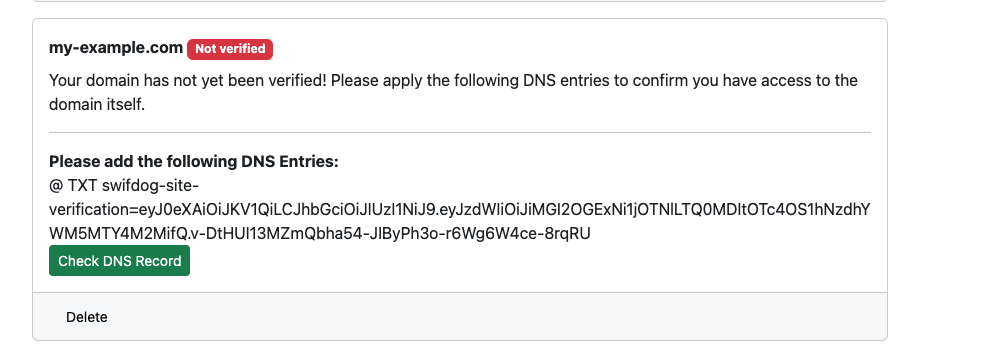
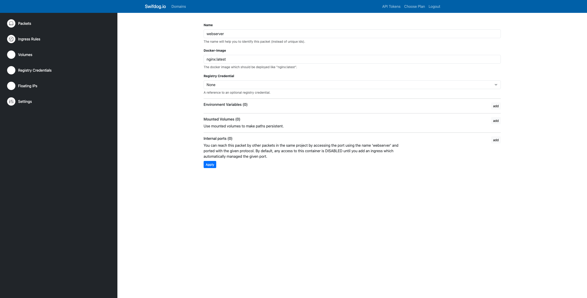
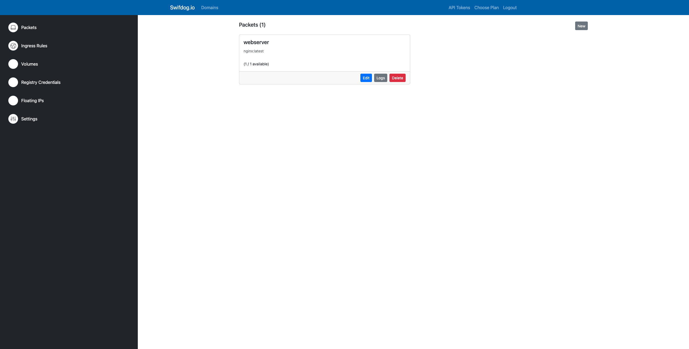
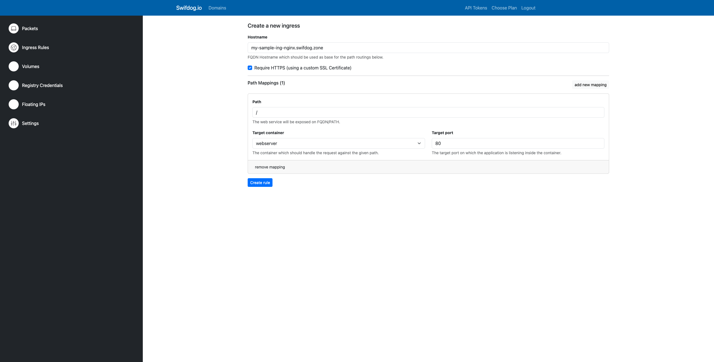
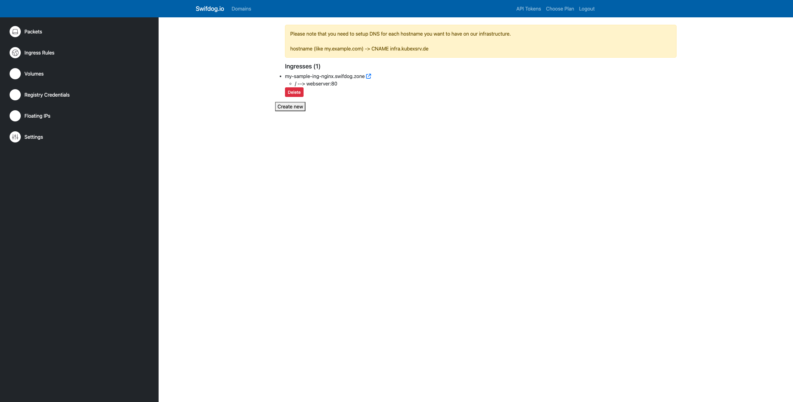

# Simple NGINX Website on Swifdog.io

This guide will walk you through the process of setting up a basic NGINX container with an ingress. This setup allows
you to host a simple website using NGINX and make it accessible through a domain or subdomain.

> Note: Any of these steps can be automated using our own Terraform provider! Check out [our Terraform Provider documentation](https://registry.terraform.io/providers/swifdog/swifdog/latest/docs) for more details.

## Custom Domains

If you prefer to use your own domain, you can follow these steps to set it up. However, for the purpose of this
tutorial, we will use a free ".swifdog.zone" domain with an unclaimed subdomain.

To configure your own domain, follow these steps:

1. On the main page, navigate to "Domains". In the provided input field, enter your domain name (e.g., example.com)
   without any subdomain or prefix. Click on "Add" to add it to the list.
2. Look for a message in the domain card that says "Please add the following DNS entries." Copy the token labeled "
   swifdog-site-verification=...".

3. Access your DNS management and create a new DNS TXT record with "@" as the entry name and the copied token as the
   value.
4. Allow some time for your DNS to update. You can verify the DNS record using tools
   like [Google Admin Toolbox DIG](https://toolbox.googleapps.com/apps/dig/#TXT/).
5. After your DNS updates, return to the Domains page, and click "Check DNS Record" to confirm the addition. If you
   encounter issues, contact support or try again later.

## Getting Started

Follow these steps to set up the NGINX container and ingress:

1. Create a new project and provide a name and description for it.
2. Create a new packet named "webserver." Use the "nginx:latest" container image from Docker Hub. For this tutorial, exposing ports, adding environment variables, and mounting volumes are unnecessary.

3. Once the packet is successfully created, the container should be running. Check the resource overview to confirm. If not, refresh your page.

4. Configure an Ingress for the website. For this tutorial, we'll use the provided domain. Create an ingress with the hostname "testing-nginx.swifdog.zone." If this hostname is taken, choose an available subdomain. Set the path to "/" and select the "webserver" container with target port 80.

5. Click "Create Rule." Access the created hostname using a web browser. Keep in mind that there might be a delay when issuing new certificates through Let's Encrypt. If you encounter an "unsecure connection" message, refresh the page or clear certificate caches.

That's it 🎉! You've successfully set up a basic NGINX website using containers and an ingress. Feel free to explore further customization and optimizations based on your needs.
